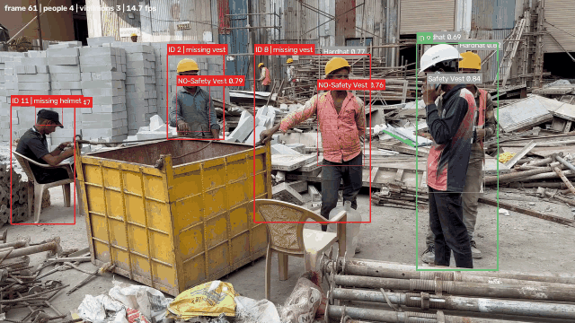
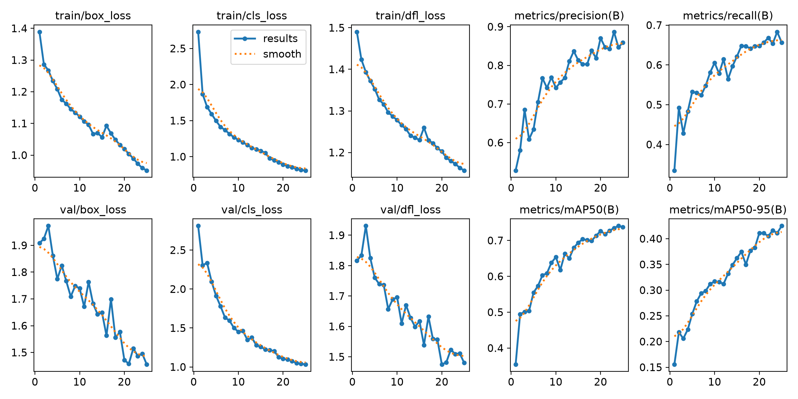
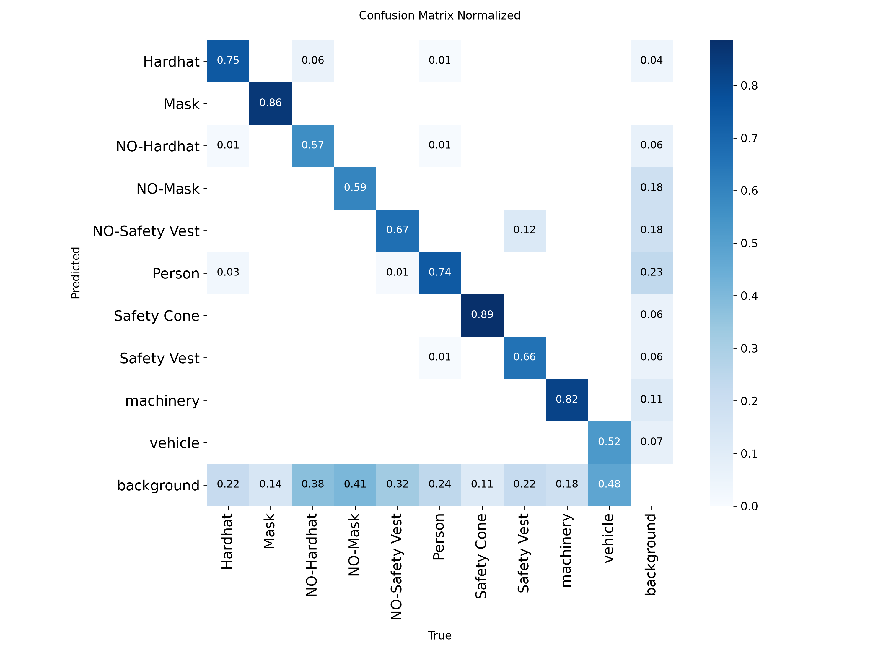

# PPE Compliance Detection

Watches a video of a construction site, tracks each worker, and flags anyone who isn't wearing a helmet or a safety vest.



Green box = compliant. Red box = missing something, and the label says what. Every violation also lands in a CSV with the timestamp and the person's track ID, so you can go back and check.

I built this over a weekend as a portfolio piece. The idea came from reading about how utilities and construction firms still rely on someone physically watching CCTV feeds to catch PPE violations, which obviously doesn't scale. This is a small, working version of the automated alternative.

## How it works

```
video ──► YOLOv8n ──► ByteTrack ──► violation rule ──► annotated .mp4 + violations.csv
          (detect)    (track IDs)   (who's missing what)
```

1. **Detection.** A YOLOv8n model I fine-tuned on a public construction-safety dataset finds `Person`, `Hardhat`, `NO-Hardhat`, `Safety Vest` and `NO-Safety Vest` boxes in each frame.
2. **Tracking.** ByteTrack (built into Ultralytics) links person boxes across frames so each worker keeps the same ID as they move around.
3. **Rule.** For every tracked person, if a `NO-Hardhat` or `NO-Safety Vest` box sits mostly inside their bounding box, they're flagged. That's it. No second model, just box geometry.
4. **Output.** Boxes and labels are drawn on the frame, and a violation is written to the CSV the moment a person's status changes (so you get one row per incident, not one per frame).

## Results

Fine-tuned YOLOv8n for 25 epochs on an RTX 4060 laptop GPU. Took about 8 minutes.

| Class | Precision | Recall | mAP@0.5 |
|---|---|---|---|
| Hardhat | 0.91 | 0.73 | 0.83 |
| NO-Hardhat | 0.86 | 0.55 | 0.65 |
| Safety Vest | 0.87 | 0.65 | 0.77 |
| NO-Safety Vest | 0.79 | 0.61 | 0.68 |
| Person | 0.85 | 0.70 | 0.76 |
| **All 10 classes** | 0.84 | 0.67 | **0.74** |

Validation split: 114 images, 697 objects. Inference runs at roughly 24 fps on the same GPU at 720p, tracking included.

<details>
<summary>Training curves and confusion matrix</summary>



</details>

The `NO-*` classes have noticeably lower recall than their positive counterparts. Looking at the confusion matrix, a lot of `NO-Hardhat` gets predicted as background rather than as `Hardhat`, which makes sense: a bare head is a much less distinctive object than a bright yellow helmet.

## Running it

You need Python 3.10+ and ideally an NVIDIA GPU. It runs on CPU too, just slower.

```powershell
# Windows
.\setup.ps1
```

```bash
# Linux / macOS
python -m venv .venv && source .venv/bin/activate
pip install torch torchvision   # pick the right CUDA build from pytorch.org
pip install -r requirements.txt
```

Then point it at a video:

```bash
python src/ppe_pipeline.py --source samples/site.mp4 --weights models/best.pt --show-ppe --show
```

Or your webcam:

```bash
python src/ppe_pipeline.py --source 0 --weights models/best.pt --show
```

Output goes to `outputs/<name>_annotated.mp4` and `outputs/<name>_violations.csv`.

Flags worth knowing about:

| Flag | What it does |
|---|---|
| `--require helmet` | only helmets are mandatory (default is helmet and vest) |
| `--require-positive` | also flag someone if *no* helmet/vest box is found on them, not just when a `NO-*` box is |
| `--overlap 0.5` | how much of the PPE box has to be inside the person box to count |
| `--conf 0.35` | detection confidence threshold |
| `--show-ppe` | draw the raw helmet/vest boxes too, not just the person boxes |
| `--tracker botsort.yaml` | swap ByteTrack for BoT-SORT |

Class names are matched loosely, so a model trained on a dataset that calls them `helmet` / `no_helmet` / `vest` works without any changes. The mapping is printed on startup.

### Training your own

Download a YOLO-format PPE dataset into `data/ppe/` (needs a `data.yaml`), then:

```bash
python src/train.py --data data/ppe/data.yaml --epochs 25
```

It prints the mAP at the end and copies the best weights to `models/best.pt`.

## Things I'd fix next

**Overlapping people.** If two workers stand close together, one person's box can contain the other's vest. Right now that vest counts for both of them. The fix is to assign each PPE detection only to the smallest person box that contains it, but I haven't done that yet.

**Flicker.** When a `NO-Safety Vest` detection hovers around the confidence threshold it blinks on and off, and each blink writes a new row to the CSV. A rolling window ("flagged in 5 of the last 8 frames") would clean that up.

**No re-identification.** If a worker leaves the frame and comes back, they get a new ID. Fine for a single clip, not fine for a full shift.

**Dataset size.** 2.6k training images, most of them augmented copies of ~500 originals. More real variety would help the `NO-*` classes most.

## Dataset

[Construction Site Safety](https://universe.roboflow.com/roboflow-universe-projects/construction-site-safety) by Roboflow Universe Projects, version 27, CC BY 4.0. The demo clip is a free stock video from Pexels.

## Stack

Python, [Ultralytics YOLOv8](https://github.com/ultralytics/ultralytics), ByteTrack, OpenCV, PyTorch.

## License

MIT. The dataset and the fine-tuned weights derived from it are under the dataset's CC BY 4.0 terms.
